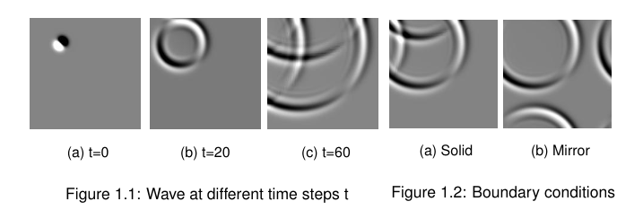
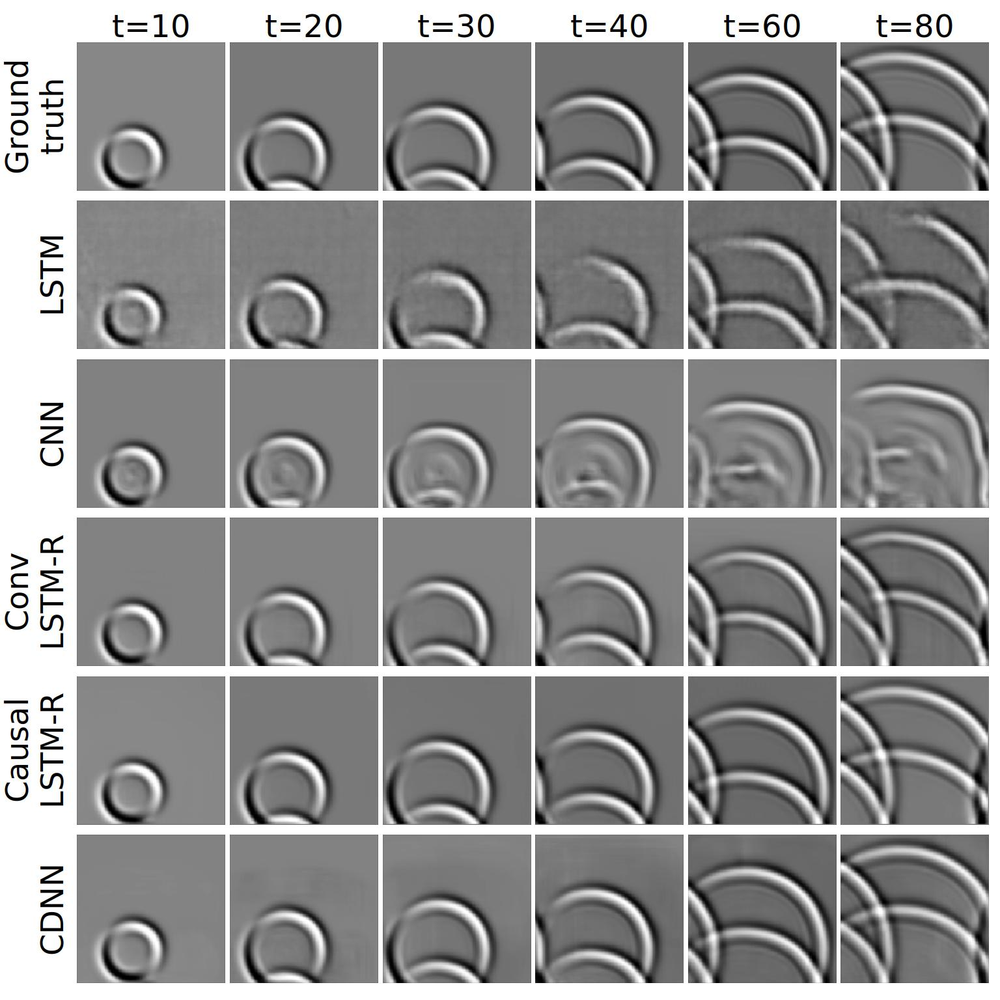

## About

Framework to train deep learning networks to predict wave propagation. This repo accompanies the [Fotiadis et. al. "Comparing recurrent and convolutional neural networks for predicting wave propagation"](https://arxiv.org/abs/2002.08981) paper which appears on the ICLR 2020 Workshop on Deep Learning and Differential Equations. The data are simulations from shallow water equations (also known as Saint-Venant equations). You can use this framework to train 5 different architectures: LSTM, ConvLSTM, Causal LSTM (i.e. PredRNN++) ,  Dilated ResNet-like, U-Net (CDNN). 


To get an idea this is how the dataset looks like.


And here's some qualitative results for the prediction in the test set.



The project started as the thesis project for the MSc in Artificial Intelligence at the University of Edinburgh. The thesis itself can be found [here](https://github.com/stathius/wave_propagation/raw/master/thesis/thesis_final.pdf). 


## How to use

### Data and data generation


To faciliate the reproduction of my results you can download the same datasets I have used [here](https://imperialcollegelondon.box.com/s/hj1o82rwj8shlqekf2iyugo5u0ow50hz). 

You can also generate more data using the script in the `data_generation` folder.

`
python generate.py --location ./small_tank --container_size_mix 1 --container_size_max 2 --data_points 100
`

| Argument   | Type     | Default    | Description                                   |
| ------------------------ | -------- | ---------- | ------------------------------------------------------------ |
|location|str|'./debug_data_gen'|Folder to save the files|
|azimuth|int|45|Lighting angle|
|azimuth_random|bool|False|Lighting angle random|
|viewing_angle|int|20|Viewing angle|
|container_size_min|int|10|Minumum size of the water container|
|container_size_max|int|20|Maximum size of the water container|
|water_depth|int|10|
|initial_stimulus|int|1|Strength of initial stimuli|
|coriolis_force|float|0.0|Coriolis force coefficient|
|water_viscocity|int|1e-6|Water viscocity|
|total_time|float|1.0|Total sequence time in seconds|
|dt|float|0.01|Time interval between frames in seconds|
|image_size_x|int|184|Pixel size of the output images|
|image_size_y|int|184|Pixel size of the output images|
|data_points|int|500|How many sequences to create|

### Setup

Install the requirements with your package manager, i.e.  ` pip install -r requirements.txt`

In the `config.ini` fill in the data folder and the folder you want the experiments to be saved.

### Train

You can use the framework to train 5 different models: LSTM, ConvLSTM, Causal LSTM, Resnet-like and U-Net (CDNN). The full list of parameters can be found in the table below.

The following trains a U-Net with a specific weight decay coefficient:

`python train_network.py --experiment_name unet_wd_1e-5 --model_type --weight_decay_coefficient 1e-5 `


There are many available arguments.

| Argument                 | Type     | Default    | Description                                                  |
| ------------------------ | -------- | ---------- | ------------------------------------------------------------ |
| model_type               | str      | NA         | Network architecture for training [ar_lstm convlstm, resnet, unet, predrnn] |
| num_epochs               | int      | 50         | The experiment's epoch budget                                |
| num_input_frames         | int      | 5          | How many frames to insert initially                          |
| num_output_frames        | int      | 20         | How many framres to predict in the future                    |
| dataset                  | str      | 'original' | select which dataset to use [original, fixed_tub]             |
| batch_size               | int      | 16         | Batch size                                                   |
| samples_per_sequence     | int      | 10         | How may training points to generate from each simulation sequence |
| experiment_name          | str      | 'dummy'    | Experiment name - used for building the experiment folder    |
| normalizer_type          | str      | 'normal'   | how to normalize the images [normal, m1to1 (-1 to 1), none]  |
| num_workers              | int      | 8          | how many workers for the dataloader                          |
| seed                     | int      | 12345      | Seed to use for random number generator for experiment       |
| seed_everything          | str2bool | True       | Use seed for everything random (numpy, pytorch, python)      |
| debug                    | str2bool | False      | For debugging purposes                                       |
| weight_decay_coefficient | float    | 1e-05      | Weight decay to use for Adam                                 |
| learning_rate            | float    | 1e-04      | Learning rate to use for Adam                                |
| scheduler_patience       | int      | 7          | Epoch patience before reducing learning_rate                 |
| scheduler_factor         | float    | 0.1        | Factor to reduce learning_rated                              |
| continue_experiment      | str2bool | False      | Whether the experiment should continue from the last epoch   |
| back_and_forth           | bool     | False      | If training will be with predicting both future and past     |
| reinsert_frequency       | int      | 10         | LSTM: how often to use the reinsert mechanism                |


### Test

This is used to assess the generalization capabilities of a model. The test are run on all the datasets that are provided above. If you want to change that you'll need to change the dataloaders in the `evaluate_experiment` function in `utils/experiment_evaluatory.py`,

`python test_network.py --experiment_name unet_wd_1e-5`

Available arguments:

| Argument                 | Type     | Default    | Description                                                  |
| ------------------------ | -------- | ---------- | ------------------------------------------------------------ |
| test_starting_point      | int      | 15         | Which frame to start the test                                |
| num_total_output_frames  | int      | 80         | How many frames to predict to the future during evaluation   |
| get_sample_predictions   | str2bool | True       | Print sample predictions figures or not                      |
| num_output_keep_frames   | int      | 20         | How many frames to keep from each propagation in RNN models |
| refeed                   | str2bool | False      | Whether to use the refeed mechanism in RNNs                  |

## Cite

If you want to cite this work please use this:
```
@inproceedings{Fotiadis2020,
author = {Fotiadis, Stathi and Pignatelli, Eduardo and Valencia, Mario Lino and Cantwell, Chris and Storkey, Amos and Bharath, Anil A.},
title = {{Comparing recurrent and convolutional neural networks for predicting wave propagation}},
url = {http://arxiv.org/abs/2002.08981},
year = {2020},
booktitle = {{ICLR} {W}orkshop on {Deep Neural Models 
and Differential Equations}}
}
```
